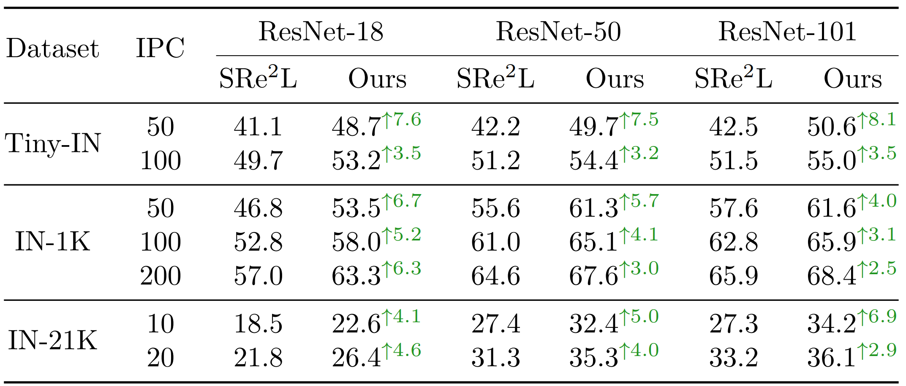

# Dataset Distillation in Large Data Era

Official PyTorch implementation of paper :
>[__"Dataset Distillation in Large Data Era"__](https://arxiv.org/abs/23XXX)<br>


<div align=center>

</div>

## Table of Contents

- [Abstract](#abstract)
- [Requirements](#requirements)
- [Usage](#usage)
	- [Squeeze](#Squeeze)
    - [Recover](#recover)
    - [Relabel](#relabel)
- [Results](#Results)
- [Download](#Download)
- [Citation](#Citation)

## Abstract

Dataset distillation aims to generate a smaller but representative subset from a large dataset, which allows a model to be trained efficiently, meanwhile evaluating on the original testing data distribution to achieve decent performance. Many prior works have aimed to align with diverse aspects of the original datasets, such as matching the training weight trajectories, gradient, feature/BatchNorm distributions, etc.
In this work, we show how to distill various large-scale datasets such as full ImageNet-1K/21K under a conventional input resolution of 224 $\times$ 224 to achieve the best accuracy over all previous approaches, including SRe<sup>2</sup>L, TESLA and MTT.
To achieve this, we introduce a simple yet effective **C**urriculum **D**ata **A**ugmentation (**CDA**) during data synthesis that obtains the accuracy on large-scale ImageNet-1K and 21K with 63.2\% under IPC (Images Per Class) 50 and 36.1\% under IPC 20, respectively. Finally, we show that, by integrating all our enhancements together, the proposed model beats the current state-of-the-art by more than 4\% top-1 accuracy on ImageNet-1K and for the first time, reduces the gap to its full-data training counterpart to less than absolute 15\%. Moreover, this work represents the inaugural success in dataset distillation on larger-scale ImageNet-21K under the standard 224 $\times$ 224 resolution.

## Requirements

- Python Environment
    - Python 3.8
    - CUDA 11.7
    - torch 1.13.1
    - torchvision 0.14.1

- Hardware
    - NVIDIA RTX 4090 24GB GPU
    - 4x NVIDIA A100 40GB GPUs (recommended for squeezing ImageNet-21K)


## Usage
### Squeeze

- Tiny-ImageNet<br>
    We adapt the [official torchvision classification code](https://github.com/pytorch/vision/tree/main/references/classification) to train  squeezing models on Tiny-ImageNet. You can find the training code and checkpoints at [tiny-imagenet repo](https://github.com/zeyuanyin/tiny-imagenet).

- ImageNet-1K<br>
    We use the off-the-shelf [PyTorch’s pretrained models](https://pytorch.org/vision/stable/models.html) with IMAGENET1K_V1 weight as squeezing models freely.

- ImageNet-21K<br>
    We follow the [ImageNet-21K-P](https://github.com/Alibaba-MIIL/ImageNet21K) to train squeezing models on ImageNet-21K (Winter 2021 version).
    <!-- You can find the checkpoints at [](). -->


### Recover

- Tiny-ImageNet

    ```bash
    python recover_cda_tiny.py \
    --arch-name "resnet18" \
    --arch-path 'path/to/squeezed_model.pth' \
    --exp-name "cda_tiny_rn18E50_4K_ipc50" \
    --syn-data-path './syn-data' \
    --batch-size 100 \
    --lr 0.4 \
    --r-bn 0.05 \
    --iteration 4000 \
    --store-best-images \
    --easy2hard-mode "cosine" --milestone 1 \
    --ipc-start 0 --ipc-end 50 \
    ```

    It will take about 4.5 hours to recover the distilled Tiny-ImageNet with IPC50 on a single 4090 GPU.

- ImageNet-1K


    ```bash
    python recover_cda_in1k.py \
    --arch-name "resnet18" \
    --exp-name "cda_in1k_rn18_4K_ipc50" \
    --syn-data-path './syn-data' \
    --batch-size 100 \
    --lr 0.25 \
    --r-bn 0.01 \
    --iteration 4000 \
    --store-best-images \
    --easy2hard-mode "cosine" --milestone 1 \
    --ipc-start 0 --ipc-end 50
    ```

    It will take about 29 hours to recover the distilled ImageNet-1K with IPC50 on a single 4090 GPU.

- ImgaNet-21K

    ```bash
    python recover_cda_in21k.py \
    --arch-name "resnet18" \
    --arch-path 'path/to/squeezed_model.pth' \
    --exp-name "cda_in21k_rn18E80_2K_ipc20" \
    --syn-data-path './syn-data' \
    --batch-size 100 \
    --lr 0.05 \
    --r-bn 0.25 \
    --iteration 2000 \
    --store-best-images \
    --easy2hard-mode "cosine" --milestone 1 \
    --ipc-start 0 --ipc-end 20
    ```

    It will take about 55 hours to recover the distilled ImageNet-21K with IPC20 on 4x 4090 GPUs.

### Relabel

We follow [SRe<sup>2</sup>L relabeling method](../SRe2L/recover/) and use the above squeezing model to relabel distilled datasets.


## Results

Our Top-1 accuracy (%) under different IPC settings on Tiny-ImageNet, ImageNet-1K and ImageNet-21K datasets:

<div align=center>

</div>

We present a comparative visualization of the gradient synthetic images at recovery steps of {100, 500, 1,000, 2,000} to illustrate the differences between SRe<sup>2</sup>L (upper) and our CDA (lower) within the dataset distillation process.

<div align=center>

</div>

## Download

You can download distilled data from [](https://huggingface.co/datasets/zeyuanyin/SRe2L/tree/main/cda).

| dataset | resolution | iteration | IPC | files |
|:---:|:---:|:---:|:---:| :---:|
| Tiny-ImageNet-200 | 64x64 | 1K | 50 | [images](https://huggingface.co/datasets/zeyuanyin/SRe2L/resolve/main/cda/cda_tiny_rn18_4k_ipc100.zip)|
| ImageNet-1K | 224x224 | 4K | 200 | [images](https://huggingface.co/datasets/zeyuanyin/SRe2L/resolve/main/cda/cda_in1k_rn18_4k_ipc200.zip)|
| ImageNet-21K | 224x224 | 2K | 20 | [images](https://huggingface.co/datasets/zeyuanyin/SRe2L/resolve/main/cda/cda_in21k_rn18_2k_ipc20.zip)|


## Citation

```
@article{yin2023dataset,
  title={Dataset Distillation in Large Data Era},
  author={Yin, Zeyuan and Shen, Zhiqiang},
  journal={arXiv preprint arXiv:2311.},
  year={2023}
}
```