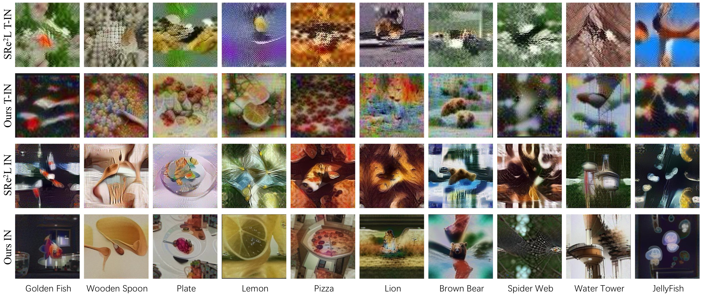
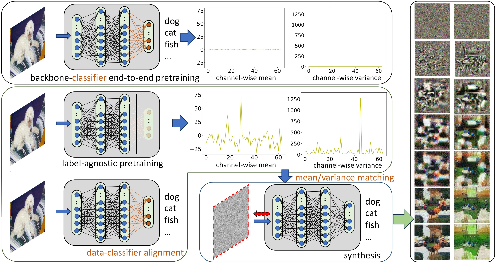
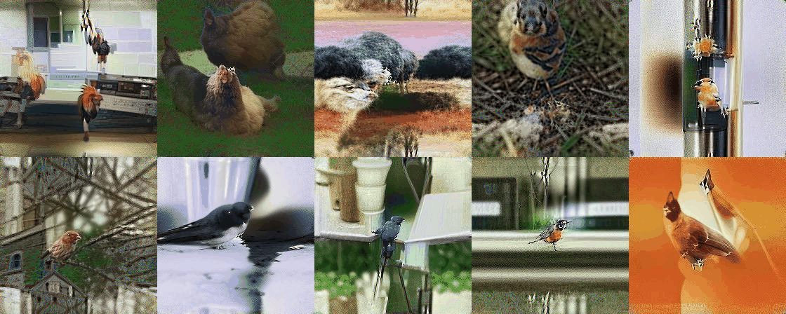
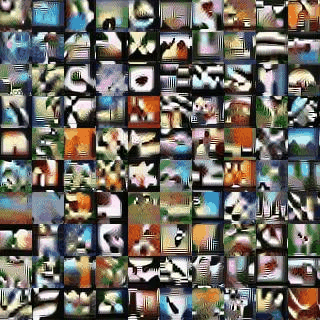
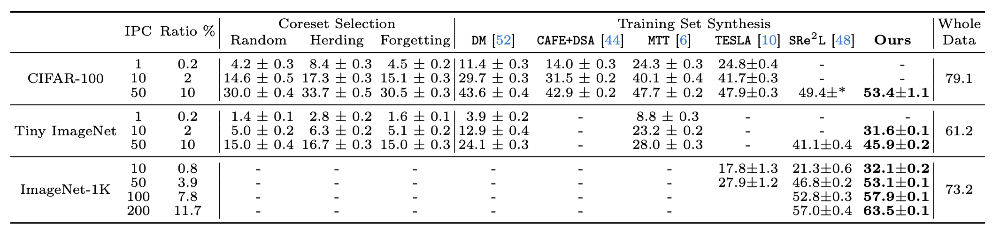
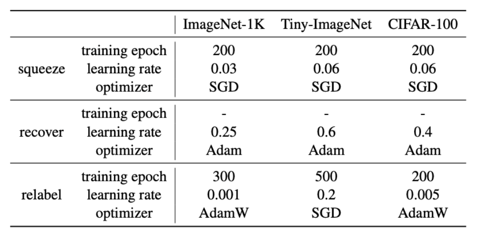

# Self-supervised Compression Method for Dataset Distillation 

:fire: The official implementation of "**A Good Compression Is All You Need for Dataset Distillation**" 

<div align=center>

</div>

## Abstract
Dataset distillation aims to *compress* information and knowledge from a large-scale original dataset to a new compact dataset while striving to preserve the utmost degree of the original data's informational essence. Previous studies have predominantly concentrated on aligning the intermediate statistics between the original and distilled data, such as weight trajectory, features, gradient, BatchNorm, etc. 

In this work, we consider addressing this task through the new lens of **model informativeness** in compression on the original dataset pretraining. We observe that with the prior state-of-the-art SRe&sup2;L, as model sizes increase, it becomes increasingly challenging for supervised pretrained models to retrieve learned information during data synthesis, as the channel-wise mean and variance inside the model are flatting and less informative. Building on this observation, we introduce SC-DD, a **S**elf-supervised **C**ompression method for **D**ataset **D**istillation that facilitates diverse information compression and recovery compared to traditional supervised learning schemes, further reaps the potential of large pretrained models with enhanced capabilities. 

Extensive experiments are conducted on CIFAR-100, Tiny-ImageNet and ImageNet-1K datasets to demonstrate the superiority of our proposed approach. The proposed SC-DD outperforms all previous state-of-the-art supervised dataset distillation methods when employing larger models, such as SRe&sup2;L, MTT, TESLA, DC, CAFE, etc., by large margins. 

<div align=center>

</div>

This picture is the overview of our learning paradigm. The top-left subfigure is the paradigm of supervised pertaining with an end-to-end training scheme for both the backbone network and final alignment classifier. The bottom-left subfigure is the paradigm of our proposed procedure for dataset distillation: a backbone model is first pretrained using a self-supervised objective, then a linear probing layer is adjusted to align the distribution of pertaining and target dataset distribution. We do not fine-tune the backbone during the alignment phase to preserve the better intermediate distributions of mean and variance in batch normalization layers (illustrated in the middle yellow line chart of the figure). The bottom-middle subfigure is the data synthesis procedure and the left subfigure is the visualization of distilled images.

## Synthetic Images

Below, we present our synthetic images generated on ImageNet-1K, which subjectively closely resemble real images.

<div align=center>

</div>


Additionally, we have included our synthetic images on CIFAR-100. Please be patient if the GIF does not display immediately.

<div align=center>

</div>


## Experiments

The code has been tested with
- Python 3.9, CUDA 12.2, PyTorch 2.0.1

Please refer to [INSTALL](./source/install.md) for the installation details. 

Our work comprises three main sections: Squeeze, Recover, and Relabel, which is derived from [SRe2L](https://github.com/VILA-Lab/SRe2L/tree/main/SRe2L). Below, you'll find the instructions for running each part. We provide the code for ImageNet-1K and CIFAR-100; please find the code in the corresponding folder. 

### Squeeze

In our paper, we used MoCo v2, MoCo v3, SwAV, and DINO as the self-supervised models. For further training details, please refer to the following links.
| Model | Link |
| ----- | ---- |
| MoCo v2 | [MoCo-v2](https://github.com/facebookresearch/moco) |
| MoCo v3 | [MoCo-v3](https://github.com/facebookresearch/moco-v3) |
| SwAV | [SwAV](https://github.com/facebookresearch/swav) |
| DINO | [DINO](https://github.com/facebookresearch/dino) |

### Recover
1. For ImageNet-1K -> recover data from a self-supervised ResNet-50 model, `cd imagenet_code/recover`, then run:
```bash
python data_synthesis.py --arch-name "resnet50" --exp-name "recover_resnet50_ipc50" --pretrained "/your/pretrained_model.pth.tar" --syn-data-path './syn_data' --lr 0.1 --iteration 1000 --r-bn 0.01 --store-best-images --index-start 0 --index-end 50 
```

2. For CIFAR-100 -> recover data from a self-supervised ResNet-18 model, `cd cifar100_code/recover`, then run: 
```bash
python recover_cifar100.py --arch-name "resnet18" --arch-path "/your/path/model_ckpt.pth" --exp-name "recover_cifar100_resnet18_ipc50" --syn-data-path './syn_data' --lr 0.4 --iteration 1000 --r-bn 0.005 --store-best-images --ipc-start 0 --ipc-end 50 
```

### Relabel & Validation

1. For ImageNet-1K -> validate the relabeled synthetic data, `cd imagenet_code/post_train`, then run: 
```bash
python train_kd.py --batch-size 64 --model resnet18 --teacher-model resnet18 --epochs 300 --cos --mix-type 'cutmix' --val-dir /your/path/imagenet/val --train-dir /your/synthesis_data_path --output-dir ./save 
```

2. For CIFAR-100 -> validate the relabeled synthetic data, `cd cifar100_code/post_train`, then run: 
```bash
python post_cifar100.py --epochs 200 --lr 0.005 --student-model resnet18 --teacher-model resnet18 --teacher-model-dir '/your/path/resnet_18_ckpt.pth' --train-dir '/your/path/syn_data' --output-dir ./save 
```

## Performance
Here is the table displaying the Top-1 validation accuracy in Relabel phase obtained from training with 10, 50, 100, and 200 synthetic images per class. Both SRe&sup2;L and our method utilize ResNet-18. For additional results, please refer to our paper. 

<div align=center>

</div>


Please find our hyper-parameters below. 
<div align=center>

</div>


Please download our synthetic data of ImageNet-1K IPC50 using this [link]( https://drive.google.com/drive/folders/1VdqEIjohHMg3Kum77vU1-Q1uZzGJ9RVA?usp=sharing).


## Acknowledgments

Our code framework is derived from [SRe2L](https://github.com/VILA-Lab/SRe2L/tree/main/SRe2L).

